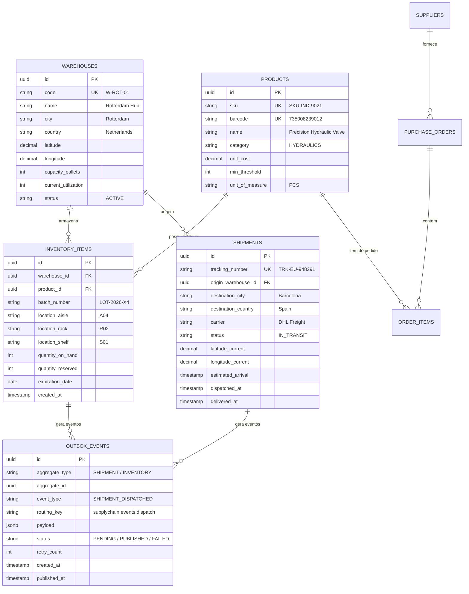

# ✦ LOGISYNC ENTERPRISE — BLUEPRINT OFICIAL ✦
## ERP Full Stack, Event-Driven Supply Chain & Global Logistics Platform

> **Portfólio Profissional — Projeto 20 (O Ápice do Portfólio)**  
> **Repositório GitHub:** `https://github.com/alxnrocha/java-fullstack-enterprise`  
> **Stack:** React 19 • TypeScript 5.8 • Vite 8 • Tailwind CSS v4 • Java 21 LTS • Spring Boot 3.3+ • Spring Data JPA • PostgreSQL 17 • RabbitMQ 3.13 (Event-Driven / Transactional Outbox Pattern) • Redis 7 • Flyway Migration • Springdoc OpenAPI 3.0 • Prometheus & Grafana • Testcontainers • Vitest • TanStack Table v8 • Recharts • Leaflet Maps • Docker Compose Multi-Container

---

## 1. Visão Executiva do Produto

**LogiSync Enterprise** é a plataforma definitiva de ERP e Gestão de Cadeia de Suprimentos (*Supply Chain Management*) com arquitetura orientada a eventos (*Event-Driven Architecture*), rastreamento logístico em tempo real e observabilidade industrial completa. Concebida para orquestrar operações de múltiplos armazéns globais (*Rotterdam, Barcelona, Frankfurt*), gestão de estoques por SKU/Lote/Validade, ordens de compra, separação de pedidos (*picking & packing*) e despacho rastreado.

### Pilares de Negócio:
1. **Rastreamento de Estoque Multi-Armazém & Localização Física:** Controle detalhado por Armazém, Corredor (*Aisle*), Rack e Prateleira (*Shelf*), incluindo lote de fabricação e validade com alertas automáticos de reposição e ruptura de estoque.
2. **Arquitetura Event-Driven com Transactional Outbox Pattern:** Garante consistência transacional atômica no PostgreSQL 17 antes de despachar eventos de negócio assíncronos (`ORDER_CREATED`, `INVENTORY_ALLOCATED`, `SHIPMENT_DISPATCHED`, `TELEMETRY_RECORDED`) para tópicos e filas do **RabbitMQ**, eliminando perda de mensagens e inconsistências de estado (*Dual-Write Problem*).
3. **Torre de Controle Logística & Rastreamento em Tempo Real:** Visualização geográfica interativa de remessas e frotas terrestres/marítimas, telemetria de trânsito, cálculo de SLA de entrega e estimativas dinâmicas de chegada (ETA).
4. **Terminal de Operações de Armazém & Picking Ágil:** Interface de alta densidade para operários e gerentes com conferência via código de barras, checklist guiado de separação e consolidação de pacotes para expedição.
5. **Observabilidade Total & Métricas de Telemetria:** Painel integrado de métricas em tempo real (taxa de vazão de mensagens RabbitMQ, saturação de pool HikariCP, uso de memória JVM, latência de filas e integridade da tabela de Outbox).

---

## 2. Arquitetura do Sistema

```text
20-java-fullstack-enterprise/
├── client/                               # Frontend React 19 + TypeScript + Vite + Tailwind v4
│   ├── src/
│   │   ├── api/                          # Cliente HTTP Axios tipado com suporte a modo Mock Standalone
│   │   ├── assets/                       # Estilos globais e tokens Enterprise ERP (Flexport/Samsara UI)
│   │   ├── components/
│   │   │   ├── dashboard/                # KPICards, FleetMap, OutboxStream, StockAlertsCard
│   │   │   ├── inventory/                # InventoryGrid (TanStack Table), SKUDetailDrawer, LocationBadge
│   │   │   ├── warehouses/               # WarehouseSelector, CapacityGauge, ZoneLayout
│   │   │   ├── picking/                  # PickingTerminalModal, BarcodeScanChecklist, DispatchAction
│   │   │   ├── shipments/                # ShipmentTrackerMap, TrackingTimeline, CarrierBadge
│   │   │   ├── outbox/                   # OutboxEventInspector, RabbitMQQueueMonitor, JSONPayloadViewer
│   │   │   ├── telemetry/                # PrometheusMetricsCharts, HikariPoolGauge, JvmMemoryCard
│   │   │   ├── layout/                   # AppHeader, SidebarNavigation, OutboxBrokerStatusBadge
│   │   │   └── ui/                       # Primitivas: Button, Card, Badge, Modal, Input, Select, Toast
│   │   ├── data/                         # Mock datasets realistas para preview perfeito no GitHub Pages
│   │   ├── stores/                       # Zustand 5 (SupplyChainState, SelectedWarehouse, FilterStore)
│   │   ├── types/                        # Interfaces e DTOs TypeScript espelhados no backend Java
│   │   ├── App.tsx                       # Layout mestre responsivo Industrial ERP
│   │   └── main.tsx                      # Ponto de entrada React
│   ├── package.json
│   ├── tsconfig.json
│   └── vite.config.ts
├── server/                               # Backend Java 21 LTS + Spring Boot 3.3+
│   ├── src/main/java/com/alxnrocha/logisync/
│   │   ├── config/                       # RabbitMqConfig, OpenApiConfig, CorsConfig, JacksonConfig
│   │   ├── controller/                   # InventoryController, ShipmentController, OutboxController, MetricsController
│   │   ├── dto/                          # Java 21 Records (InventoryItemDTO, ShipmentDTO, OutboxEventDTO, CreateOrderDTO)
│   │   ├── entity/                       # JPA Entities (@Entity Warehouse, Product, InventoryItem, Shipment, OutboxEvent)
│   │   ├── enums/                        # ShipmentStatus, OutboxStatus, StockMovementType, PriorityLevel
│   │   ├── exception/                    # GlobalExceptionHandler (@RestControllerAdvice, RFC 7807)
│   │   ├── mapper/                       # MapStruct Mappers (Entity <-> DTO)
│   │   ├── outbox/                       # OutboxPublisherService, OutboxEventScheduler (@Scheduled)
│   │   ├── repository/                   # Spring Data JPA Repositories com queries customizadas JPQL
│   │   ├── service/                      # InventoryService, ShipmentService, OrderFulfillmentService, TelemetryService
│   │   └── LogiSyncApplication.java      # Spring Boot Main Class
│   ├── src/main/resources/
│   │   ├── db/migration/                 # V1__initial_schema.sql, V2__seed_supply_chain.sql (Flyway)
│   │   └── application.yml               # Configurações do datasource, RabbitMQ, Actuator e Swagger
│   ├── src/test/java/com/alxnrocha/logisync/
│   │   ├── integration/                  # Testes com Testcontainers (PostgreSQL 17 + RabbitMQ 3.13)
│   │   └── service/                      # Testes unitários do motor transacional e outbox (JUnit 5 + Mockito)
│   ├── pom.xml                           # Configuração Maven com Java 21, Spring Boot 3.3, AMQP
│   └── mvnw / mvnw.cmd                   # Maven Wrapper para execução autônoma
├── compose.yaml                          # Multi-container: Frontend Nginx + Backend + Postgres + RabbitMQ + Prometheus
├── design/
│   ├── mockup.png                        # Mockups oficiais de alta fidelidade
│   └── PROMPTS.md                        # Prompts de UI/UX (local, no .gitignore)
├── .github/workflows/deploy.yml          # CI/CD Pipeline (Maven build + Vitest + GitHub Pages Deploy)
├── .gitignore
├── BLUEPRINT.md
└── README.md                             # Documentação Executiva em Espanhol
```

---

## 3. Modelo de Banco de Dados Relacional (PostgreSQL 17)



---

## 4. Plano de Milestones & Issues (Protocolo FORGE-DEV)

### Milestone 1: Fundação Backend & Arquitetura Event-Driven (Issues 1 a 6)
- **Issue 1:** Bootstrap multi-módulo Java 21 LTS + Spring Boot 3.3 backend e React 19 SPA client.
- **Issue 2:** Configurar PostgreSQL 17 Flyway migrations (`V1__initial_schema.sql`, `V2__seed_supply_chain.sql`).
- **Issue 3:** Desenvolver entidades JPA, repositórios com queries customizadas e enums de domínio.
- **Issue 4:** Implementar infraestrutura RabbitMQ e configuração de filas, exchanges e routing keys.
- **Issue 5:** Desenvolver motor do **Transactional Outbox Pattern** com scheduler atômico de publicação.
- **Issue 6:** Implementar controllers REST da API (`/inventory`, `/warehouses`, `/shipments`, `/outbox`, `/telemetry`) com OpenAPI Swagger.

### Milestone 2: Frontend Industrial & Mock Engine Standalone (Issues 7 a 13)
- **Issue 7:** Desenvolver sistema de design Enterprise ERP (Tailwind v4), layout mestre e navegação.
- **Issue 8:** Implementar mock database engine e cliente API tipado para execução standalone no GitHub Pages.
- **Issue 9:** Construir dashboard geral de Supply Chain com KPIs executivos, mapa de rotas logísticas e gráficos Recharts.
- **Issue 10:** Desenvolver matriz de estoque multi-armazém com TanStack Table v8, filtros e visualizador de SKU.
- **Issue 11:** Construir terminal de separação e expedição com checklist guiado e disparo de evento Outbox.
- **Issue 12:** Implementar painel de rastreamento de remessas e frotas com mapa interativo e linha do tempo de trânsito.
- **Issue 13:** Desenvolver torre de observabilidade de eventos Outbox, telemetria RabbitMQ e inspeção de payloads JSON.

### Milestone 3: Testes Automatizados, Documentação Executiva & Deploy (Issues 14 a 16)
- **Issue 14:** Desenvolver suíte automatizada de testes com JUnit 5, Mockito, Testcontainers (PostgreSQL + RabbitMQ) e Vitest.
- **Issue 15:** Implementar pipeline CI/CD GitHub Actions, documentação técnica em espanhol e deploy no GitHub Pages.
- **Issue 16:** Configurar repositório GitHub com topics oficiais, About, Homepage e Licença MIT.
