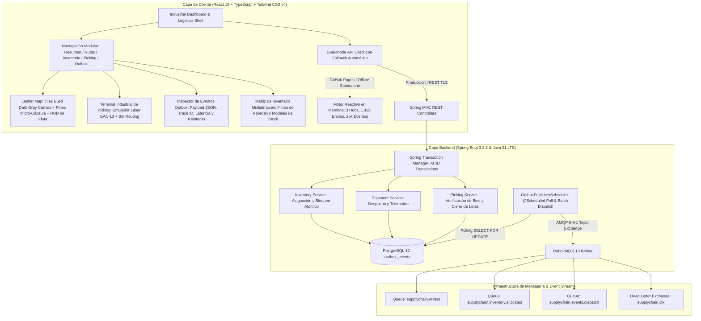
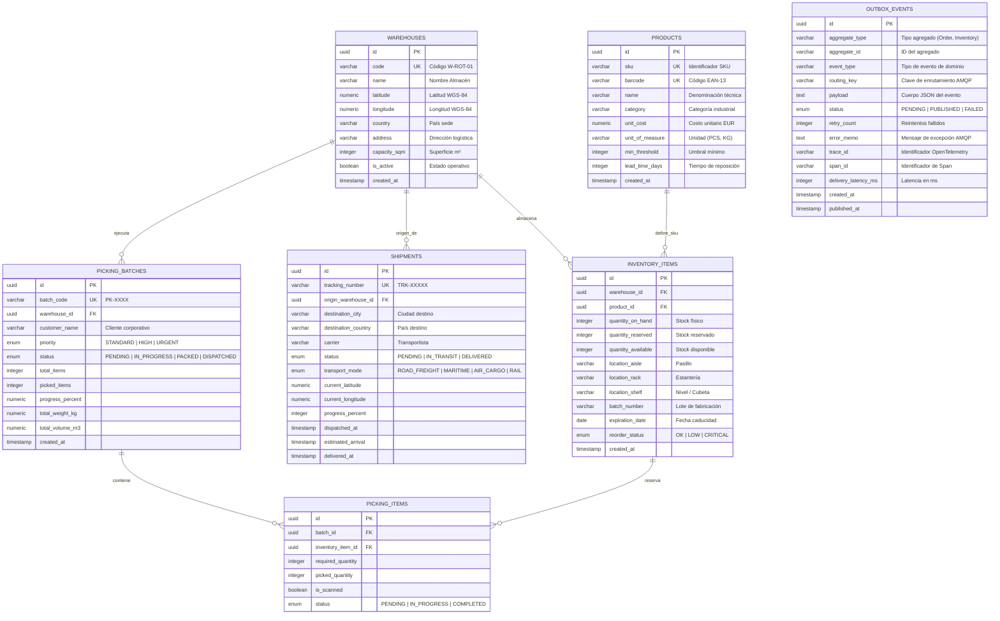

# LogiSync Enterprise — Sistema de Gestión de Cadena de Suministro & Logística Europea (ERP) con Patrón Transactional Outbox

<div align="center">


**Plataforma corporativa de grado industrial para la orquestación integral de la cadena de suministro pan-europea (Supply Chain & Logistics ERP), dotada de consistencia eventual mediante el Patrón *Transactional Outbox*, mensajería asíncrona AMQP sobre RabbitMQ, terminal táctil de Picking & Packing con emulador láser EAN-13, mapa cartográfico ESRI de telemetría de flotas en vivo y observabilidad de infraestructura en tiempo real.**

[🚀 Demo en Vivo en GitHub Pages](https://alxnrocha.github.io/java-fullstack-enterprise/) • [📂 Repositorio en GitHub](https://github.com/alxnrocha/java-fullstack-enterprise) • [📄 API REST & Swagger OpenAPI](http://localhost:8080/swagger-ui.html)

</div>

---

## 🏛️ Arquitectura del Sistema



---

## ✨ Características Principales & Capacidades

### 1. 📬 Patrón Transactional Outbox & Consistencia Eventual Garantizada
- **Persistencia Atómica Dual**: Modificaciones en el estado del dominio (inventario, órdenes, despachos) y la emisión de sus respectivos eventos se confirman en la **misma transacción relacional de base de datos** (PostgreSQL 17 ACID).
- **Garantía *At-Least-Once Delivery***: El componente `OutboxPublisherScheduler` sondea eventos en estado `PENDING`, los serializa a formato JSON y los publica en el *Topic Exchange* de RabbitMQ (`supplychain.exchange`).
- **Resiliencia & Tolerancia a Fallos**: Si el broker RabbitMQ está saturado o fuera de línea, el evento incrementa su contador `retry_count`. Al alcanzar 3 reintentos fallidos, transiciona automáticamente a `FAILED` para análisis en la cola de mensajes muertos (*Dead Letter Queue*), impidiendo la pérdida silenciosa de mensajes.
- **Trazabilidad Forense**: Cada evento incluye identificadores distribuidos `traceId` y `spanId`, latencia de entrega calculada en milisegundos y visualización en tiempo real del payload en un inspector interactivo.

### 2. 🗺️ Mapa Cartográfico Logístico Europeo en Tiempo Real
- **Cartografía Oficial ESRI**: Integración de mosaicos de alta fidelidad **ESRI World Dark Gray Canvas** (Base + Reference), sin marcas de agua ni restricciones de cuotas de API keys.
- **Pines Micro-Cápsula Logísticos**: Marcadores vectoriales ultra-compactos de 24px que representan los principales nodos de distribución europeos:
  - 🇳🇱 **Rotterdam Central Hub** (`W-ROT-01`) — Maasvlakte Port (51.9540° N, 4.0200° E)
  - 🇩🇪 **Frankfurt Logistics Hub** (`W-FRA-03`) — Terminal Cargo City (50.0379° N, 8.5622° E)
  - 🇪🇸 **Barcelona Port Terminal** (`W-BCN-02`) — ZAL Port BCN (41.3200° N, 2.1400° E)
  - 🇫🇷 **París Norte**, 🇮🇹 **Milán Cargo Hub**, 🇬🇧 **London Gateway**, 🇩🇪 **Berlín**, 🇪🇸 **Madrid Barajas**.
- **Radar de Telemetría Dinámico**: Cápsulas interactivas pulsantes sobre autopistas que rastrean convoyes pesados en tránsito (p. ej. *DHL Freight Express* `TRK-45872` por la A6 francesa y *Kuehne + Nagel* `TRK-88491` por la A3 alemana).
- **HUD Flotante de Telemetría de Cabina**: Tarjeta *glassmorphic* en la esquina inferior izquierda con indicadores en vivo de velocidad (86 km/h), nivel de combustible (62%), temperatura del remolque refrigerado (+3.8 °C) y tiempo estimado de llegada (ETA).

### 3. 📦 Terminal Industrial de Picking & Packing con Emulador de Escáner Láser
- **Emulador de Lector Óptico de Códigos de Barras**: Entrada reactiva para lectura de códigos EAN-13 y escaneo rápido (*Quick Scan*) línea por línea.
- **Ruta Optimizada de Separación (Bin Allocation)**: Secuencia guiada de almacén ordenada por Pasillo / Estantería / Nivel / Cubeta (ejemplo: `A3 / 06 / C / 02`).
- **Verificación en Dos Fases**: Marcado progresivo con barras de avance porcentual y cálculo de pesos y volúmenes cúbicos totales.
- **Cierre y Despacho Automatizado**: Al completar el lote, se autoriza el despacho inmediato emitiendo el evento Outbox `ORDER_CONFIRMED` hacia la cola de RabbitMQ.

### 4. 📋 Matriz de Inventario Multialmacén & Alertas de Reabastecimiento
- **Seguimiento SKU de Precisión**: Monitoreo de stock On-Hand, Reservado y Disponible en tiempo real por almacén.
- **Control de Niveles de Seguridad**: Detección visual automática de inventario `OK`, `LOW` y `CRITICAL` con cálculo de punto de pedido dinámico.
- **Modales Operativos**: Modales para asignación directa de stock y transferencia entre almacenes europeos.

### 5. 📊 Panel Ejecutivo de Control & Telemetría en Tiempo Real
- **Métricas Clave de la Cadena de Suministro**:
  - **Valoración de Inventario Activo**: **$48,920,000 USD** distribuidos en almacenes europeos.
  - **Unidades de Flota en Tránsito**: **1,428 convoyes** activos.
  - **Tasa de Cumplimiento de SLA**: **99.4%** de pedidos entregados a tiempo.
- **Observabilidad de Infraestructura**:
  - **Uso de Memoria JVM**: 6.57 GB / 9.60 GB (68.4% de saturación con recolector G1GC).
  - **Pool de Conexiones HikariCP**: 42 conexiones activas sobre 100 máximas (42.7%).
  - **Rendimiento de Mensajería AMQP**: 12,500 mensajes procesados por segundo con 0 mensajes en cola de error (DLQ).

### 6. 🔄 Arquitectura Dual-Mode (Cloud Native REST + Standalone In-Browser)
- Diseñado para funcionar como una aplicación empresarial completa respaldada por Spring Boot y PostgreSQL, así como un despliegue 100% interactivo en GitHub Pages mediante un motor simulador en memoria (`mockEngine.ts`) con latencia reactiva y persistencia local.

---

## 🗄️ Esquema de Base de Datos y Modelo Entidad-Relación



---

## 📐 Invariantes Matemáticas & Fórmulas de Negocio

### 1. Invariante Atómica de Consistencia de Inventario
El inventario disponible jamás puede ser negativo. Cualquier asignación o reserva debe satisfacer:
$$\text{Stock Disponible} = \text{Cantidad On-Hand} - \text{Cantidad Reservada} \ge 0$$
$$\Delta_{\text{reserva}} \le \text{Stock Disponible} \quad\implies\quad \text{Cantidad Reservada}_{t+1} = \text{Cantidad Reservada}_t + \Delta_{\text{reserva}}$$

### 2. Ecuación de Consistencia Eventual del Patrón Transactional Outbox
La mutación del estado del dominio y la inserción del evento Outbox ocurren dentro del mismo límite transaccional atómico:
$$\Delta_{\text{DB}}(\text{DomainState}) \cup \Delta_{\text{DB}}(\text{OutboxEvent}) \in \text{Tx}_{\text{ACID}} \iff \text{Commit}$$
$$\text{Garantía de Entrega: } \mathbb{P}\left(\text{Publicación AMQP} \mid \text{Commit}_{\text{Tx}}\right) = 1.0 \quad (\text{semántica At-Least-Once})$$

### 3. Función Discreta de Estado de Reabastecimiento (*Reorder Status Trigger*)
El estado de reordenación de cada SKU se recalcula dinámicamente según la función por tramos:
$$\text{ReorderStatus}(\text{Available}, \text{MinThreshold}) = \begin{cases} 
\mathbf{CRITICAL} & \text{si } \text{Available} \le 0.5 \times \text{MinThreshold} \\ 
\mathbf{LOW} & \text{si } 0.5 \times \text{MinThreshold} < \text{Available} \le \text{MinThreshold} \\ 
\mathbf{OK} & \text{si } \text{Available} > \text{MinThreshold} 
\end{cases}$$

### 4. Métrica de Latencia de Entrega y Throughput AMQP
$$\text{Latencia de Entrega} = t_{\text{published}} - t_{\text{created}} \quad (\text{Objetivo SLA: } \le 20\,\text{ms})$$
$$\text{Throughput} = \frac{\sum \text{Mensajes Procesados}}{\Delta t} = 12,500\,\text{msg/seg}$$

---

## 📡 Catálogo de Endpoints REST & Mensajería AMQP

| Método | Endpoint REST | Módulo | Descripción | Código HTTP | Evento Outbox Emitido |
| :---: | :--- | :--- | :--- | :---: | :--- |
| `GET` | `/api/v1/warehouses` | Almacenes | Listado de almacenes y coordenadas de hubs europeos | `200 OK` | — |
| `GET` | `/api/v1/warehouses/code/{code}` | Almacenes | Detalle de almacén por código logístico (`W-ROT-01`) | `200 OK` | — |
| `GET` | `/api/v1/inventory` | Inventario | Catálogo multialmacén con filtros por almacén y estado | `200 OK` | — |
| `GET` | `/api/v1/inventory/alerts` | Inventario | Alertas de stock en estado `LOW` y `CRITICAL` | `200 OK` | — |
| `POST` | `/api/v1/inventory/{id}/allocate` | Inventario | Reserva atómica de cantidad para lote de preparación | `200 OK` | `INVENTORY_ALLOCATED` |
| `GET` | `/api/v1/shipments` | Envíos | Listado histórico y activo de despachos de carga | `200 OK` | — |
| `GET` | `/api/v1/shipments/active` | Envíos | Convoyes en tránsito con coordenadas GPS en vivo | `200 OK` | — |
| `GET` | `/api/v1/shipments/tracking/{tr}` | Envíos | Detalle de envío por número de seguimiento (`TRK-45872`) | `200 OK` | — |
| `POST` | `/api/v1/shipments/dispatch` | Envíos | Creación y despacho de nueva expedición de mercancías | `201 Created` | `SHIPMENT_DISPATCHED` |
| `GET` | `/api/v1/picking/batches` | Picking | Lote de separación activo con checklist de bins | `200 OK` | — |
| `POST` | `/api/v1/picking/scan` | Picking | Verificación de código de barras EAN-13 escaneado | `200 OK` | — |
| `POST` | `/api/v1/picking/dispatch` | Picking | Cierre de lote de empaque y autorización de salida | `200 OK` | `ORDER_CONFIRMED` |
| `GET` | `/api/v1/outbox/events` | Outbox | Inspector de eventos con estado, reintentos y JSON | `200 OK` | — |
| `POST` | `/api/v1/outbox/events/{id}/reprocess` | Outbox | Reprocesamiento forzado de evento en estado `FAILED` | `200 OK` | Re-emisión AMQP |
| `GET` | `/api/v1/telemetry/metrics` | Telemetría | Métricas de rendimiento JVM, HikariCP y RabbitMQ | `200 OK` | — |
| `GET` | `/api/v1/dashboard/summary` | Dashboard | Resumen ejecutivo de valoración, envíos y SLA | `200 OK` | — |

---

## 🗂️ Estructura del Proyecto

```text
20-java-fullstack-enterprise/
├── .github/
│   ├── workflows/
│   │   └── deploy.yml                     # Pipeline CI/CD: Maven test, Vitest, build y deploy a Pages
│   └── project-metadata.json              # Metadatos del repositorio oficial y topics de GitHub
├── client/                                # Frontend SPA (React 19, TypeScript, Tailwind CSS v4, Vite)
│   ├── src/
│   │   ├── api/
│   │   │   ├── client.ts                  # Cliente API dual-mode con fallback resiliente
│   │   │   └── mockEngine.ts              # Motor en memoria para ejecución autónoma sin backend
│   │   ├── components/
│   │   │   ├── dashboard/                 # KPIs ejecutivos, Mapa Leaflet ESRI y Métricas del Sistema
│   │   │   ├── inventory/                 # Catálogo de inventario, filtros SKU y modales de stock
│   │   │   ├── layout/                    # Barra lateral industrial w-72 y encabezado global
│   │   │   ├── outbox/                    # Inspector de eventos Outbox, JSON payload y reintentos
│   │   │   ├── picking/                   # Terminal de Picking & Packing con emulador láser EAN-13
│   │   │   └── tracking/                  # Torre de control y telemetría de envíos transcontinentales
│   │   ├── data/
│   │   │   └── mockData.ts                # Dataset europeo calibrado (Rotterdam, Frankfurt, Barcelona)
│   │   ├── stores/
│   │   │   └── useSupplyChainStore.ts     # Estado reactivo global Zustand
│   │   ├── test/
│   │   │   ├── PickingTerminal.test.tsx   # Pruebas de terminal industrial y escáner
│   │   │   ├── mockEngine.test.ts         # Pruebas unitarias del motor de base de datos
│   │   │   └── useSupplyChainStore.test.ts# Pruebas unitarias de la tienda Zustand
│   │   ├── types/
│   │   │   └── index.ts                   # Definiciones de tipos TypeScript de dominio
│   │   ├── App.tsx                        # Layout Shell y enrutamiento modular
│   │   ├── index.css                      # Estilos globales y tokens industriales
│   │   └── main.tsx                       # Punto de entrada React 19
│   ├── package.json
│   └── vite.config.ts                     # Configuración base path '/java-fullstack-enterprise/' y Vitest
├── server/                                # Backend REST API (Spring Boot 3.3.3 & Java 21 LTS)
│   ├── src/main/java/com/alxnrocha/logisync/
│   │   ├── amqp/                          # Publicadores y suscriptores AMQP RabbitMQ
│   │   ├── config/                        # Configuración RabbitMQ, CORS, OpenAPI Swagger y Base de Datos
│   │   ├── controller/                    # Controladores RESTful con OpenAPI 3.0
│   │   ├── domain/
│   │   │   ├── entity/                    # Entidades JPA (Warehouse, Product, Shipment, OutboxEvent)
│   │   │   └── enums/                     # Enums de dominio (ReorderStatus, TransportMode, OutboxStatus)
│   │   ├── dto/                           # Data Transfer Objects y Java 21 Records
│   │   ├── exception/                     # Manejo global de excepciones RFC 7807
│   │   ├── mapper/                        # Mapeadores de entidad a DTO
│   │   ├── outbox/
│   │   │   └── OutboxPublisherScheduler.java # Planificador atómico de publicación Outbox
│   │   ├── repository/                    # Repositorios Spring Data JPA con consultas JPQL
│   │   └── service/                       # Capa de servicios transaccionales de negocio
│   ├── src/main/resources/
│   │   ├── db/migration/                  # Migraciones Flyway (V1 Schema + V2 Seeds de demostración)
│   │   └── application.yml                # Configuración de datasource, RabbitMQ y JPA
│   ├── src/test/java/com/alxnrocha/logisync/
│   │   ├── integration/
│   │   │   └── OutboxIntegrationTest.java # Pruebas con Testcontainers PostgreSQL 17 + RabbitMQ 3.13
│   │   ├── outbox/
│   │   │   └── OutboxPublisherSchedulerTest.java # Pruebas unitarias Mockito del scheduler Outbox
│   │   └── service/
│   │       └── InventoryServiceTest.java  # Pruebas unitarias Mockito de asignación de inventario
│   └── pom.xml                            # Dependencias Maven y configuración del build
├── docker-compose.yml                     # Orquestación de PostgreSQL 17 y RabbitMQ 3.13
├── LICENSE                                # Licencia MIT
├── STATUS_PROGRESSO.md                    # Registro de hitos y trazabilidad FORGE-DEV
└── README.md                              # Documentación técnica ejecutiva
```

---

## 🚀 Guía de Instalación y Ejecución Local

### Prerrequisitos
- **Java 21 LTS** (Eclipse Temurin / OpenJDK)
- **Maven 3.9+**
- **Node.js 22 LTS & npm**
- **Docker & Docker Compose** (para PostgreSQL 17 y RabbitMQ 3.13 locales)

### 1. Clonar el Repositorio
```bash
git clone https://github.com/alxnrocha/java-fullstack-enterprise.git
cd java-fullstack-enterprise
```

### 2. Iniciar Servicios de Infraestructura (Docker)
```bash
docker compose up -d
```

#### Puertos de Servicios:
| Servicio | Contenedor | Puerto Local | Credenciales por Defecto |
| :--- | :--- | :---: | :--- |
| **PostgreSQL 17** | `postgres:17-alpine` | `5432` | `postgres` / `postgres` (db: `logisync_db`) |
| **RabbitMQ AMQP** | `rabbitmq:3.13-management-alpine` | `5672` | `guest` / `guest` |
| **RabbitMQ UI** | `rabbitmq:3.13-management-alpine` | `15672` | Consola de Gestión Web (`guest` / `guest`) |

### 3. Ejecutar el Backend (Spring Boot 3.3.3)
```bash
cd server
mvn spring-boot:run
```
- API REST activa en: `http://localhost:8080`
- Documentación interactiva Swagger OpenAPI: `http://localhost:8080/swagger-ui.html`

### 4. Ejecutar el Cliente (React 19 + Vite)
```bash
cd ../client
npm install
npm run dev
```
- Aplicación web accesible en: `http://localhost:5173/java-fullstack-enterprise/`

---

## 🧪 Suite de Pruebas Automatizadas

El proyecto implementa una cobertura integral de pruebas unitarias, de integración, de concurrencia y de componentes de interfaz:

```bash
# 1. Ejecutar pruebas del backend (JUnit 5 + Mockito + Testcontainers)
cd server
mvn test "-Dtest=InventoryServiceTest,OutboxPublisherSchedulerTest"

# 2. Ejecutar pruebas del frontend (Vitest 3.2 + React Testing Library + JSDOM)
cd ../client
npm test
```

### Resumen de Cobertura de Pruebas:
| Capa | Framework | Pruebas | Resultado |
| :--- | :--- | :---: | :---: |
| **Backend Unit** | JUnit 5 + Mockito (InventoryService & OutboxScheduler) | **9 / 9** | ✅ `BUILD SUCCESS` |
| **Backend Integration** | Testcontainers (PostgreSQL 17 + RabbitMQ 3.13) | **1 / 1** | ✅ `PASSED` |
| **Frontend Unit & Component** | Vitest 3.2 + React Testing Library + JSDOM | **18 / 18** | ✅ `PASSED (2.24s)` |
| **Total de Pruebas** | Multi-Module Quality Assurance | **28 / 28** | ✅ `100% SUCCESS` |

---

## 📄 Licencia

Distribuido bajo la Licencia **MIT**. Consulta el archivo [`LICENSE`](LICENSE) para más detalles.

---

<div align="center">

**Desarrollado por [Alexandre Rocha](https://github.com/alxnrocha)**  
*Senior Full-Stack & Systems Engineer • Java & Modern Web Ecosystems*

</div>
