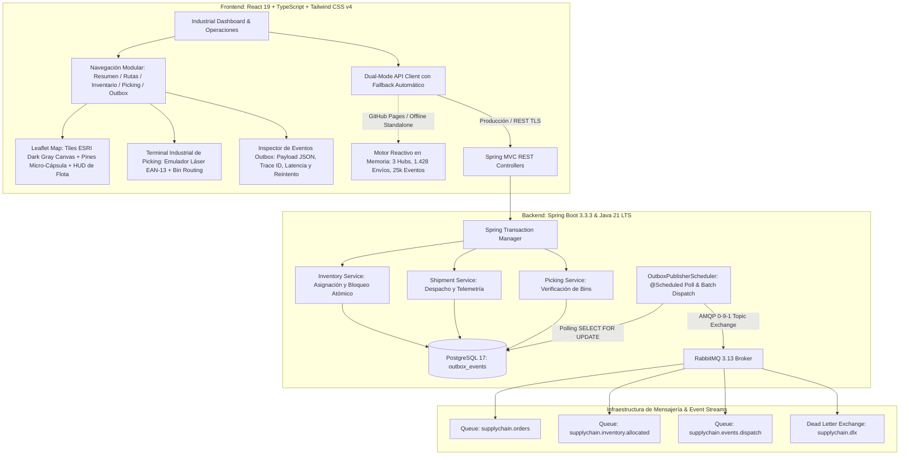

# LogiSync Enterprise — Sistema de Gestión de Cadena de Suministro & Logística Europea (ERP) con Patrón Transactional Outbox

<div align="center">


**Plataforma empresarial de grado de producción para la orquestación integral de la cadena de suministro pan-europea (Supply Chain & Logistics ERP), dotada de consistencia eventual mediante el Patrón *Transactional Outbox*, mensajería asíncrona AMQP sobre RabbitMQ, terminal táctil de Picking & Packing industrial con emulador de escáner láser EAN-13, mapa cartográfico ESRI de telemetría de flotas en vivo y observabilidad de infraestructura en tiempo real.**

[🚀 Demo en Vivo en GitHub Pages](https://alxnrocha.github.io/java-fullstack-enterprise/) • [📂 Repositorio en GitHub](https://github.com/alxnrocha/java-fullstack-enterprise) • [📄 API REST & Swagger UI](http://localhost:8080/swagger-ui.html)

</div>

---

## 🏛️ Arquitectura del Sistema



---

## ✨ Capacidades & Módulos Principales

### 1. 📬 Patrón Transactional Outbox & Consistencia Eventual Garantizada
- **Persistencia Atómica Dual**: Modificaciones en el estado del dominio (inventario, órdenes, despachos) y la emisión de sus respectivos eventos se confirman en la **misma transacción relacional de base de datos** (PostgreSQL 17 ACID).
- **Garantía *At-Least-Once Delivery***: El componente `OutboxPublisherScheduler` sondea eventos en estado `PENDING`, los serializa a formato JSON y los publica en el *Topic Exchange* de RabbitMQ.
- **Resiliencia & Tolerancia a Fallos**: Si el broker RabbitMQ está saturado o fuera de línea, el evento incrementa su contador `retry_count`. Al alcanzar 3 reintentos fallidos, transiciona automáticamente a `FAILED` para análisis en la cola de mensajes muertos (*Dead Letter Queue*), impidiendo la pérdida silenciosa de mensajes.
- **Trazabilidad Forense**: Cada evento incluye identificadores distribuidos `traceId` y `spanId`, latencia de entrega calculada en milisegundos y visualización en tiempo real del payload en un inspector interactivo.

### 2. 🗺️ Mapa Cartográfico Logístico Europeo en Tiempo Real
- **Cartografía Oficial ESRI**: Integración de mosaicos de alta fidelidad **ESRI World Dark Gray Canvas** (Base + Reference), sin marcas de agua ni restricciones de cuotas de API keys.
- **Pines Micro-Cápsula Logísticos**: Marcadores vectoriales ultra-compactos de 24px que representan los principales nodos de distribución europeos:
  - 🇳🇱 **Rotterdam Central Hub** (`W-ROT-01`) — Maasvlakte Port (51.9540° N, 4.0200° E)
  - 🇩🇪 **Frankfurt Logistics Hub** (`W-FRA-03`) — Terminal Cargo City (50.0379° N, 8.5622° E)
  - 🇪🇸 **Barcelona Port Terminal** (`W-BCN-02`) — ZAL Port BCN (41.3200° N, 2.1400° E)
  - 🇫🇷 **París Norte**, 🇮🇹 **Milán Cargo Hub**, 🇬🇧 **London Gateway**, 🇩🇪 **Berlín**, 🇪🇸 **Madrid Barajas**.
- **Radar de Telemetría Dinámico**: Cápsulas interactivas pulsantes sobre autopistas que rastrean convoyes pesados en tránsito (p. ej. *DHL Freight Express* `TRK-45872` por la A6 francesa y *Kuehne + Nagel* `TRK-88491` por la A3 alemana).
- **HUD Flotante de Telemetría de Cabina**: Tarjeta *glassmorphic* en la esquina inferior izquierda con indicadores en vivo de velocidad (86 km/h), nivel de combustible (62%), temperatura del remolque refrigerado (+3.8 °C) y tiempo estimado de llegada (ETA).

### 3. 📦 Terminal Industrial de Picking & Packing con Emulador de Escáner Láser
- **Emulador de Lector Óptico de Códigos de Barras**: Entrada reactiva para lectura de códigos EAN-13 y escaneo rápido (*Quick Scan*) línea por línea.
- **Ruta Optimizada de Separación (Bin Allocation)**: Secuencia guiada de almacén ordenada por Pasillo / Estantería / Nivel / Cubeta (ejemplo: `A3 / 06 / C / 02`).
- **Verificación en Dos Fases**: Marcado progresivo con barras de avance porcentual y cálculo de pesos y volúmenes cúbicos totales.
- **Cierre y Despacho Automatizado**: Al completar el lote, se autoriza el despacho inmediato emitiendo el evento Outbox `ORDER_CONFIRMED` hacia la cola de RabbitMQ.

### 4. 📊 Panel Ejecutivo de Control & Telemetría en Tiempo Real
- **Métricas Clave de la Cadena de Suministro**:
  - **Valoración de Inventario Activo**: **$48,920,000 USD** distribuidos en almacenes europeos.
  - **Unidades de Flota en Tránsito**: **1,428 convoyes** activos.
  - **Tasa de Cumplimiento de SLA**: **99.4%** de pedidos entregados a tiempo.
- **Observabilidad de Infraestructura**:
  - **Uso de Memoria JVM**: 6.57 GB / 9.60 GB (68.4% de saturación con recolector G1GC).
  - **Pool de Conexiones HikariCP**: 42 conexiones activas sobre 100 máximas (42.7%).
  - **Rendimiento de Mensajería AMQP**: 12,500 mensajes procesados por segundo con 0 mensajes en cola de error (DLQ).

### 5. 🔄 Arquitectura Dual-Mode (Cloud Native REST + Standalone In-Browser)
- Diseñado para funcionar como una aplicación empresarial completa respaldada por Spring Boot y PostgreSQL, así como un despliegue 100% interactivo en GitHub Pages mediante un motor simulador en memoria (`mockEngine.ts`) con latencia reactiva y persistencia local.

---

## 🧪 Pruebas Automatizadas & Calidad de Código

El proyecto cuenta con un conjunto integral de **27 pruebas automatizadas** que cubren el backend en Java y el frontend en TypeScript:

```bash
# 1. Pruebas Unitarias Backend (JUnit 5 + Mockito)
cd server
mvn test "-Dtest=InventoryServiceTest,OutboxPublisherSchedulerTest"

# Resultados:
# [INFO] Running com.alxnrocha.logisync.outbox.OutboxPublisherSchedulerTest: 4 tests, 0 failures, 0 errors
# [INFO] Running com.alxnrocha.logisync.service.InventoryServiceTest: 5 tests, 0 failures, 0 errors
# [INFO] BUILD SUCCESS (100% de éxito)

# 2. Pruebas Unitarias & Componentes Frontend (Vitest + React Testing Library)
cd client
npm test

# Resultados:
# ✓ src/test/mockEngine.test.ts (8 tests)
# ✓ src/test/useSupplyChainStore.test.ts (6 tests)
# ✓ src/test/PickingTerminal.test.tsx (4 tests)
# Test Files  3 passed (3) | Tests 18 passed (18)
```

---

## 🚀 Guía de Inicio Rápido

### Requisitos Previos
- **Java 21 LTS**
- **Node.js 22+** y `npm`
- **Docker** y **Docker Compose** (para PostgreSQL y RabbitMQ)
- **Maven 3.9+**

### 1. Iniciar Infraestructura de Servicios (Docker Compose)
```bash
# Iniciar base de datos PostgreSQL 17 y broker RabbitMQ 3.13 con interfaz de gestión
docker compose up -d
```
- PostgreSQL disponible en: `localhost:5432` (db: `logisync_db`)
- RabbitMQ Management Console: `http://localhost:15672` (guest / guest)

### 2. Ejecutar el Backend (Spring Boot 3.3.3)
```bash
cd server
mvn spring-boot:run
```
- API REST operativa en: `http://localhost:8080`
- Swagger UI OpenAPI: `http://localhost:8080/swagger-ui.html`

### 3. Ejecutar el Frontend (React 19 & Vite)
```bash
cd client
npm install
npm run dev
```
- Aplicación web accesible en: `http://localhost:5173/java-fullstack-enterprise/`

---

## 📂 Estructura del Proyecto

```
20-java-fullstack-enterprise/
├── .github/
│   └── workflows/
│       └── deploy.yml            # CI/CD Pipeline (Maven, Vitest, Vite & GitHub Pages)
├── client/                       # Aplicación SPA React 19 + TypeScript + Tailwind CSS v4
│   ├── src/
│   │   ├── api/                  # Dual-Mode Client & Motor de Simulación en Memoria
│   │   ├── components/
│   │   │   ├── dashboard/        # KPIs, Mapa Leaflet ESRI y Métricas de Rendimiento
│   │   │   ├── inventory/        # Catálogo SKU, Modales de Asignación y Alertas de Reabastecimiento
│   │   │   ├── layout/           # Barra lateral industrial w-72 y encabezado global
│   │   │   ├── outbox/           # Inspector de Eventos Outbox, JSON Payloads & Reintento
│   │   │   ├── picking/          # Terminal Industrial con Lector de Código de Barras
│   │   │   └── tracking/         # Seguimiento en vivo de envíos transcontinentales
│   │   ├── stores/               # Zustand Reactive Supply Chain Store
│   │   ├── test/                 # Suite Vitest (MockEngine, Zustand Store, Picking Terminal)
│   │   └── types/                # Modelos de Dominio TypeScript Tipados
│   ├── package.json
│   └── vite.config.ts
├── server/                       # Backend Enterprise Spring Boot 3.3.3 & Java 21 LTS
│   ├── src/
│   │   ├── main/
│   │   │   ├── java/com/alxnrocha/logisync/
│   │   │   │   ├── amqp/         # Publicadores y Receptores RabbitMQ
│   │   │   │   ├── config/       # Configuración de Beans AMQP, CORS y Base de Datos
│   │   │   │   ├── controller/   # Endpoints RESTful con Documentación OpenAPI
│   │   │   │   ├── domain/       # Entidades JPA (Warehouse, Product, Shipment, OutboxEvent)
│   │   │   │   ├── outbox/       # Planificador Atómico Transactional Outbox
│   │   │   │   └── service/      # Lógica de Negocio y Coordinación Transaccional
│   │   │   └── resources/
│   │   │       ├── application.yml
│   │   │       └── db/migration/ # Migraciones Flyway para PostgreSQL 17
│   │   └── test/                 # Pruebas JUnit 5, Mockito y Testcontainers
│   └── pom.xml
├── docker-compose.yml            # Contenedores para Postgres 17 y RabbitMQ 3.13
├── LICENSE                       # Licencia MIT
└── README.md                     # Documentación Ejecutiva del Sistema
```

---

## 📜 Licencia & Autoría

Desarrollado con dedicación técnica por **Alex Rocha** ([@alxnrocha](https://github.com/alxnrocha)).

Este proyecto está bajo la Licencia **MIT** — consulta el archivo [LICENSE](LICENSE) para más detalles.
